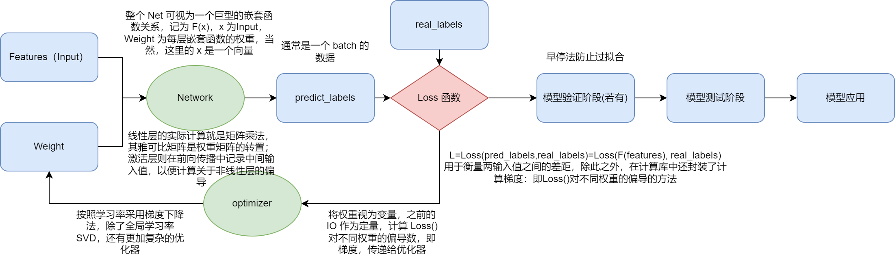

# 机器学习训练过程

1. [数据集](##数据集)
2. [数据预处理](##数据预处理)
3. [数据分割](##数据分割)
4. [模型建立](##模型建立)
   + [训练过程](###训练过程)

参考文献：[参考](##参考)

##  数据集

是构建机器学习训练过程的起点，简单地说，数据集是一个 $M\times{N}$ 的矩阵，是由 Features 和 Labels 二元关系构成的集合。当然，你也可以叫他们 Input 和 Output。

一个仅含有 Features 的数据集用于无监督学习；如果数据集中的 Labels 定量，则通常用于回归问题，而如果数据集中的 Labels 定性，则用于分类问题。

> **tips:**
>
> 当然，真实的数据集往往更加复杂，比如图像数据集的 Features 显然更加复杂，实际数据集往往不是一个二维矩阵，而是更加高维的情况。

## 数据预处理

数据预处理是指对数据进行各种检查和审查的过程，以纠正缺失值、拼写错误、使数值正常化/标准化以使其具有可比性等等。如果是图像数据集可能还会对图像进行一些基本的 CV 处理，若有需要，此后会专门新增一个章节说明。

数据预处理对模型的训练效果影响巨大，是在进行 ML 训练时必须花费精力做的一部分。

## 数据分割

通常有多种分割方式，适用于不同场景的模型训练：

+ 训练、测试集分割
+ 训练、验证、测试集分割
+ 交叉验证

### 训练、测试集分割

是最通用的做法，为了防止训练过程中对训练集过拟合，测试过程一般不应当采用训练投入的数据进行测试，以测试模型在未见过的数据上的性能。

## 模型建立

做好以上工作后，终于可以进行模型的建立了，需理解整个模型训练过程中的整体流程：

### 训练过程

所有机器学习的训练过程都大致可以用以下流程图表示：

#### 梯度下降法

梯度下降法是 optimizer 在接收到 Loss 函数反向传播完成梯度计算后执行的逻辑，目的是对整个 Weight 矩阵按照超参数进行更新，最关键部分的理解还是 Loss 函数中完成梯度运算的过程：

+ 各个运算库在该过程中充分复用了前向传播中的中间值：
  + 线性层的中间输入无需缓存，因为其偏导至于权重值有关而与输入无关
  + 在前向传播的过程中会缓存非线性层（如激活函数）的输入，通常称为计算图中的**激活缓存**，因为其关于输入的偏导数与输入有关，为了在反向传播中不再计算，因此这里进行缓存

$$

$$

## 参考

+ https://github.com/dataprofessor/infographic
+ https://zhuanlan.zhihu.com/p/184673895

