# InfiniGen

## 简单总结

基于卸载的 KVCache 缓存管理系统，旨在降低 LLM 在面对超长上下文时推理过程的显存消耗。

## Intro

目前 LLM 普遍追求 long context 场景下的推理，从初代 GPT 的 512 token 到目前 Gemini、Claude 的最高 1 million 的上下文长度，将显著增加 KVCache 的存储消耗，对存储提出挑战。

以往的推理框架支持 offload 到 CPU 内存，但瓶颈变成了内存与显存的传输带宽。

InfiniGen 作为新型的 KVCache 管理系统而提出，旨在高效管理 KV 显存，核心思想如下：

+ 提出了新型KVCache预取技术，根据上一次的注意力分数结果，推测后续注意力模式，并仅将重要部分加载到显存，**其余部分保留**在 CPU 内存中。

## Background

### Transformer

transformer 为 encoder-decoder 架构，encoder 和 decoder 分别有，通常一个基本的 tranformer block 由一个注意力模块和 FFN（全连接网络） 构成，注意力层中由若干注意力头，每个注意力头单独执行注意力运算，归一化后的张量作为输入进入注意力层执行**注意力运算**。

+ 注意力输入会与Q、K、V 三种**权重**矩阵相乘，以生成对应的Q、K、V向量，Q向量会与**历史**所有 token 的 K、V向量（包括本身所对应的K、V 向量）进行注意力分数运算
+ 由于需要记录历史 token 的 K、V 向量，组成的 K、V向量集合需要进行存储，由此需要使用 KVCache

### KVCache

生成式 LLM 推理涉及到两个主要阶段，即 prefill 阶段（接受 input token，计算出 first new token）和 decoding 阶段（生成后续 token）。

根据**上文**提到过的，生成新 token 时，注意力运算需要计算该token 与先前“所有” token 的关系，以便预测该 token 并符合上下文，即前文提到过的注意力分数运算。

若重复计算历史 token 的 K、V向量，显然运算开销过大，通常的做法就是使用 **KVCache**。KV Cache 会在每次迭代时增加存储一行 KV 向量。

### LLM 的离群值

根据调查，LLM 在 Transformer block 的 input vector 中存在具有显著更大幅值的元素，通常出现在少数固定通道（某些矩阵列）中。

### SVD分解

经过测试，对 Q 矩阵和 K 矩阵进行“偏斜”处理，使这些离群通道的数值远大于其他通道，并使用这些通道计算注意力分数，能够有效预测 important token。

具体的，即将Q、K 矩阵与一个特定的正交矩阵相乘，将其与 Q 矩阵拉伸最显著方向对齐，得到相对应的偏斜矩阵。

找到这个特定的正交矩阵，需要通过奇异值分解——SVD，对 Q 矩阵进行 SVD 分解，找到该正交矩阵。

> 奇异值分解：将任意 m * n 矩阵/复矩阵，分解为正交阵 * 对角阵 * 正交阵的形式，可以看作**相似对角化**的推广。
>
> 其中右奇异向量（右侧奇异矩阵的列向量）可以类比EVD（相似对角化）中的特征向量，表示了原矩阵变换“拉伸”最显著的方向

## Motivation

### KVCache管理

现代 LLM 推理系统通常支持批处理推理，每个会话都会保存自己的 KVCache，显然会对 GPU 内存带来巨大压力；同时，现代 LLM 推理系统也支持卸载功能，但 CPU 内存和 GPU 之间的 PCIe 带宽成为新的瓶颈。

还可以使用传统的预取技术，降低因带宽带来的延迟，但 load Cache （full load）的时间很长，并行度不够：

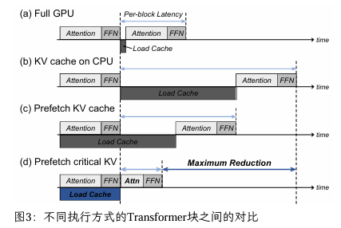

量化压缩 KV Cache 可以降低数据传输开销，但并没有根本解决，随着上下文长度的增加，KVCache 仍然是线性增长。

### 主要挑战

降低 KV Cache 从 CPU 到 GPU 传输开销，最基本的想法还是减少传输数据的大小，即只选取哪些最为关键的历史 token 对应的 KV 向量，将其加载到 GPU 进行运算，在不显著降低模型精度的情况下，显著减少 KV Cache 显存占用，同时支持更长的上下文：

先前的研究通常基于 KV 驱逐，即基于跨迭代的注意力模式通常是永久的，他们认为一个 token 在当前迭代过程中不重要的话，通常在后续的 token 生成中同样不重要，当 KV Cache 超出预算时，就将被驱逐的 token 从后续迭代中排除。

经过实验，这一想法可能在长上下文场景下是不符合真实情况的，当序列长度足够长时，之前被认为不重要的 token 仍然可能出现高注意力分数的情况。【from paper $H_2O$】

基于这一情况，通过 token 驱逐方式减少 KVCache 大小可能存在挑战，我们想要设计一种缓存管理方法，使其能够动态地从 KVCache 中选取 important token KV，同时尽量避免对 history token 进行直接驱逐。

## Design

InfiniGen 时一种建立在基于卸载的推理系统上的 KVCache 管理框架，旨在实现在低数据开销的前提下成功卸载 KVCache。核心设计原则时利用充足的 CPU 内存容量增加 window size，不会完全丢弃掉那些“目前”不重要的 KV 向量。

### 设计方案概述

InfiniGen 的设计架构如下：

如图所示，InfiniGen 在运行时包含两个主要组件。

+ 第一个组件包括部分权重索引生成控制器、KV选择控制器和推理控制器，这些控制器在服务 LLM 推理时协同推测和预取对应的 important kv cache。此外，为了辅助预取，倾斜控制器对模型权重执行了一次离线修改，见[缓存预取](###缓存预取机会（可能可以预取的时间点）)
+ 第二个组件是内存池管理器，主要用于管理卸载到 CPU 内存中的KVCache。

### 缓存预取

该系统对 KV Cache 进行预测和预取的信息来源主要基于前一层的注意力输入，通常上，大预言模型中连续注意力层的注意力输入高度相似，主要原因有使用了层归一化和参数中存在奇异值等。

基于这一点，如果我们让 Q 矩阵和 K 矩阵中某些通道更加“奇异”，则这些少数几列将更显著的影响注意力模式，这有利于我们从整个KV Cache 中提取出哪些 important KV Cache 后，对整个模型的输出结果的影响更小。

实现这一操作的主要原理就是基于SVD分解的线性变换，且该线性变换在计算注意力分数的过程中与原运算是等价的，仅仅更改了 Q、K 矩阵的形式，便于我们预测 important KV Cache：

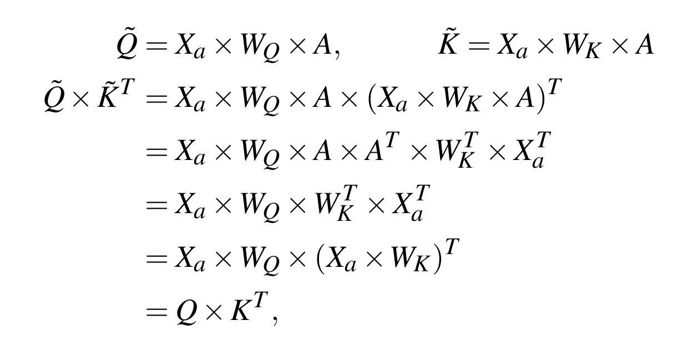

> 其中 A 是正交矩阵，所以对两个矩阵进行变换后，Q、K 矩阵的乘积在数学上是严格等价的，不影响注意力分数的运算，但得到的两个偏斜矩阵更加奇异化，方便选择部分“重要”向量

### 模块执行流程

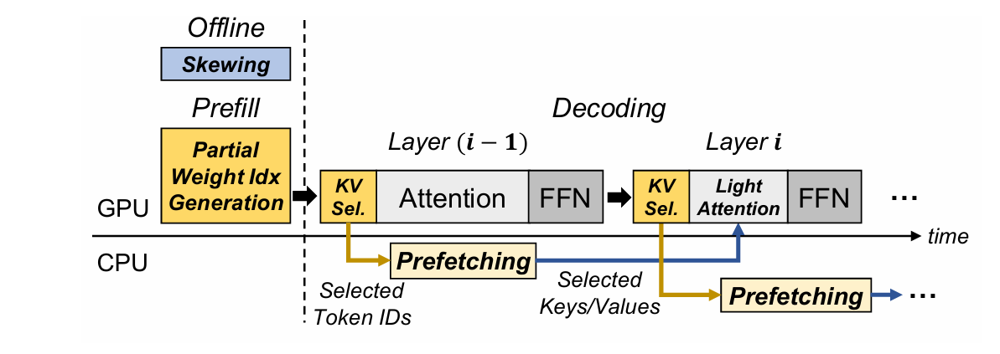

如图所示，缓存预取模块的执行流程如上图，主要有以下阶段：

+ 首先在离线阶段，InfiniGen 直接对模型 Q、K 权重矩阵进行修改，这是一个完全离线的过程，仅仅进行一次，在运行时不会产生任何额外消耗，经过倾斜处理后，注意力层仍然会产生相同的计算结果。
+ 然后在 prefill 阶段，在此阶段主要生成初始的 KVCache，并为之后的 decode 阶段准备预测工具，会选取对 K、V 两种权重矩阵都重要的哪些 top-k 列，组成一个更小的矩阵，并存储这些部分查询权重和部分键缓存

> 根据之前的信息，我们知道 偏斜后的 K、V矩阵有若干奇异列，但要找出对 Q*K 影响最大的那些列，不能只考虑单个矩阵，而要同时考虑两个矩阵，为了在尽可能降低计算量的情况下找出这些“列 pair”，InfiniGen 通过对两个矩阵绝对值相加并取 top-k 的方式决定选取哪些“列 pair”作为预测值。
>
> 当然“实际”的 top-k 可能不是这些列中的某些，因为注意力分数的计算也部分依赖于下一层输入，但我们在未进行注意力分数的乘法运算前显然不知道哪些列对下一个 token 更重要，但可以依赖于对应的奇异权重列（最好对 Q、K 两者都奇异）在乘法过后，只要对应的“输入”在一般分布上，就会“脱颖而出”。
>
> **tips：**这里的列相当于一个**通道** “channel”，而每一行则是代表一个历史 token。

+ 之后在 decode 阶段，实现动态推测和预取，InfiniGen 会在第 i-1 层执行一次**最小运算量的预演**，以预测第 i 层的注意力模式：
  + 计算部分查询向量，利用 i-1 层输入（为什么用相邻层，之前有解释）乘第 i 层的部分查询权重，得到一个推测的部分 query 向量；
  + 将部分 query 向量与第 i 层的部分键缓存进行矩阵乘法，得到注意力分数，就可以得到历史 token 的重要性，并进行选择。
+ 根据上一步的预测结果，从 CPU 内存进行预取，理想情况下，当运算来到第 i 层时，对应的 KVCache 就加载到 GPU 显存中了。

### CPU 中 KVCache 管理

虽然 CPU 内存相比 GPU 内存经济实惠且容量更大，但是仍然存在容量限制。为了对 offload 到 CPU 的 KV Cache 进行充分管理，InfiniGen 设计了一个缓存池，支持设定缓存池的大小，并针对那些很少被选中的 K、V vector 设计了合适的淘汰策略。

选用的替换策略是一种基于计数器的策略（类似于内存页面管理中的策略），是基于 FIFO 和 LRU 的一种改进策略。

 ## Evaluate

### 实验设置

+ 使用模型
  + transformer OPT
    + 6.7B
    + 13B
    + 30B
  + Llama-2
    + 7B
    + 13B
+ 使用设备
  + 显卡：NVIDIA RTX A6000 O48G
  + CPU：Intel Xeon Gold 6136
  + 内存：96G DDR4-2666Hz
  + 主线：PCIe 3.0*16
+ 使用数据集：
  + lm-evaluation-harness 基准测试集
    + COPA
    + Open-BookQA
    + WinoGrande
    + PIQA
    + RTE
  + 语言建模数据集
    + WikiText-2
    + Penn Treebank
  + PG-19，随机采样部分句子，衡量长序列长度下的加速效果
+ 使用的推理系统
  + UVM
  + FlexGen
+ 对比论文成果
  + $H_2O$，是 KV 缓存管理领域的最新方法（2024）
  + 各种量化方法

+ 关键指标
  + 准确率
  + 困惑度
  + 推理实时时间

### 实验结果

#### 推理效果对比

+ 准确率 on lm-evaluation-harness 基准测试集

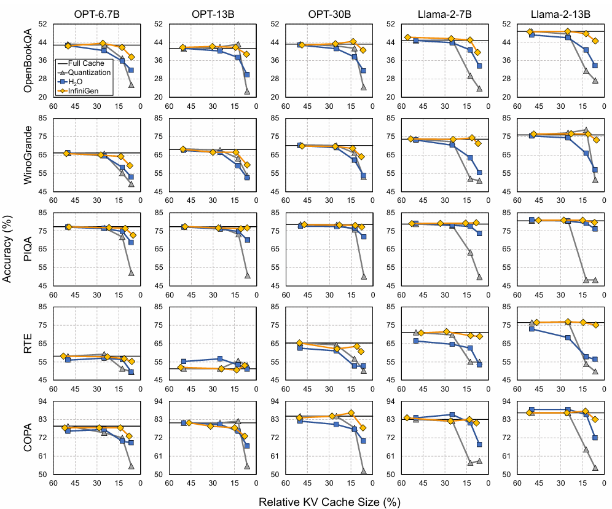

+ 困惑度 on WikiText-2 数据集

+ 是否使用偏斜操作对准确率的影响 on lm-evaluation-harness 基准测试集

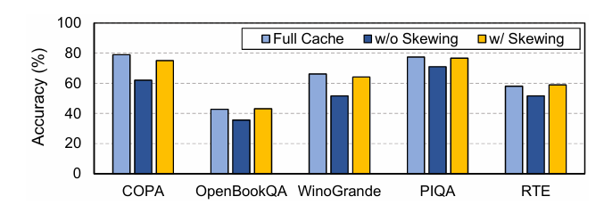

+ OPT-13B 模型在不同推理系统上的推理时延对比

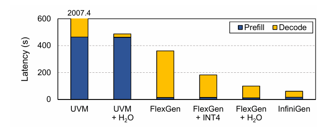

+ 不同批处理大小对 OPT-13B 模型在不同推理系统上推理时延的影响

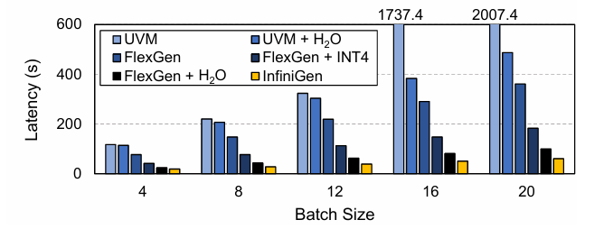

#### 推理性能对比

+ 不同序列长度和模型规模条件下，InfiniGen 对推理的加速效果对比：

#### 敏感性对比

+ 选用历史 important token 的阈值大小和选用部分权重（占总权重）的比率对准确率的影响

> 阈值，即预测注意力分数大于 Alpha value，就认为其为 important token，则将 KV vector 其加载到 GPU 中

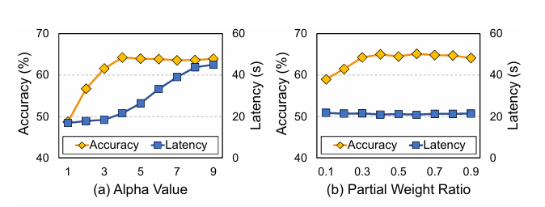

+ OPT-13B 模型，在不同推理系统上，一个 transformer block 的延迟构成

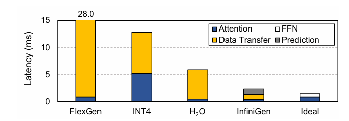

+ Llama-2-7B-32K模型，不同输入序列长度和相对 KV Cache 大小对困惑度的影响情况

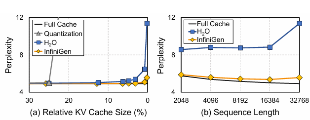

#### 长上下文场景分析

+ 对 1 million token 的上下文进行推理
  + 左图展示了随着序列长度增加，关注量小于1%的token的占比情况，可以看到序列长度足够大时，大部分 token 都将可能展示其重要性；
  + 右图展示了在最后 16K 次迭代中，采样的不同注意力头和层的注意力权重分布情况，有些之前迭代中不重要的 token 可能突然变的“重要”

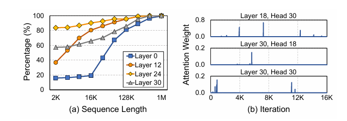

## Conclusion

InfiniGen 是一个基于卸载的动态 KV 缓存管理框架，用于高效执行大型语言模型的推理。InfiniGen利用前一层的注意力输入来推测性地预取重要 token 的 KV 缓存。我们调整查询和键权重以提 高推测效率。InfiniGen 在显著缩短推理延迟的同时，保持了语言模型性能。与现有方案相比，它在批大小、序列长度和模型大小方面也表现出更好的可扩展性。

## Improve

1. Prefill 阶段取离群列的操作是静态的，但在模型推理的不同阶段对应的注意力模式可能不同，是否可以根据模型推理的不同阶段动态调整选择离群列的数量？
2. 可以与其他的 KVCache 优化方法相结合，如量化等。

